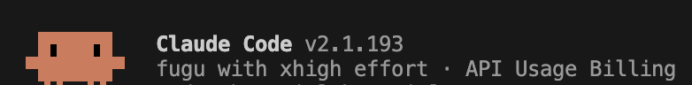
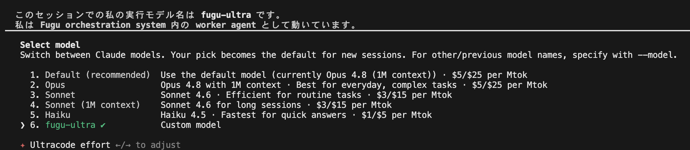

# fugu-claude-code-gateway

Run **Claude Code** on the **Sakana Fugu** model, billed to your own Sakana key.
Cross-platform (macOS/Linux), dependency-free Node proxy. No OpenRouter, no third party.

## It works

Claude Code running on Fugu Ultra — same UI, tools, and agent loop, with Fugu as the backend:



`fugu-ultra` shows up as a custom model in Claude Code's `/model` picker:



**Subagents work too.** Confirmed: when the main session runs on Fugu, dispatched
background agents route through the same gateway to Fugu as well (the proxy log
showed several parallel subagent requests all routed to `fugu-ultra`). So the full
Claude Code agent loop — chat, tools, and parallel subagents — runs on Fugu.

## Why this exists

Claude Code only speaks the **Anthropic Messages API** (`POST /v1/messages`).
Sakana exposes **OpenAI-compatible** faces only:

| Endpoint (same Sakana key) | Used by | Result |
|---|---|---|
| `POST /v1/chat/completions` | Codex, Cursor | 200 |
| `POST /v1/responses` | Codex (`wire_api=responses`) | 200 |
| `POST /v1/messages` | **Claude Code** | **404 Not Found** |

So Codex attaches directly; Claude Code can't, because Sakana has no
`/v1/messages`. This skill bundles a small, dependency-free proxy that bridges it: it accepts
Anthropic Messages from Claude Code, translates to Sakana Chat Completions, and
translates the reply (streaming SSE + tool calls) back.

> Note: a skill runs *inside* an already-started Claude Code session and **cannot**
> retarget that session. It sets up the gateway and you launch a **new** Claude
> Code process (`claude-fugu`) that talks to Fugu.

## Install

### As a plugin (recommended)

Inside Claude Code:

```
/plugin marketplace add JinZhongcun/fugu-claude-code-gateway
/plugin install fugu-claude-code-gateway@fugu-gateway
```

(`fugu-gateway` is the marketplace name from `.claude-plugin/marketplace.json`;
`fugu-claude-code-gateway` is the plugin name.)

### Manual (clone + symlink the skill)

```bash
git clone https://github.com/JinZhongcun/fugu-claude-code-gateway
ln -s "$(pwd)/fugu-claude-code-gateway/skills/fugu" ~/.claude/skills/fugu
```

## Use

```bash
export SAKANA_API_KEY=your-sakana-key      # required

# one command — auto-starts the proxy and launches Claude Code on Fugu:
./skills/fugu/claude-fugu                  # interactive
./skills/fugu/claude-fugu -p "hello"       # one-shot
FUGU_MODEL=fugu-ultra ./skills/fugu/claude-fugu   # Fugu Ultra
```

Or, inside a running Claude Code session, invoke the **`fugu`** skill and it will
start the proxy and tell you exactly how to launch.

## Diagnose

If anything misbehaves, run the bundled doctor (it never prints your key):

```bash
./skills/fugu/fugu-doctor
```

It checks node/curl/nc/claude, that `SAKANA_API_KEY` is set, that the local gateway
on `:4000` identifies as this gateway, and that Sakana is reachable.

## Configuration

| Env var | Default | Meaning |
|---|---|---|
| `SAKANA_API_KEY` | — | required; your Sakana key (read at runtime, never stored) |
| `FUGU_MODEL` | `fugu` | `fugu` or `fugu-ultra` |
| `FUGU_PORT` | `4000` | local gateway port (honored by `claude-fugu`; the proxy itself reads `PORT`) |
| `FUGU_BIND` | `127.0.0.1` | bind address — **keep loopback**; do not expose the port |
| `FUGU_EFFORT` | (off) | `high` / `xhigh` / `max` → `reasoning_effort` |
| `FUGU_TIMEOUT_MS` | `300000` | upstream timeout for `fugu` (5 min) |
| `FUGU_ULTRA_TIMEOUT_MS` | `900000` | upstream timeout for `fugu-ultra` (15 min) |
| `FUGU_ON_FAILURE` | `fail` | `fail` or `advise` — see Failure policy |

## Failure policy

This gateway **never changes models silently.** If `fugu-ultra` fails, times out, or
returns an upstream error, the request **fails visibly** — there is no automatic
fallback to `fugu`.

- `FUGU_ON_FAILURE=fail` (default) — return the upstream error as-is.
- `FUGU_ON_FAILURE=advise` — same, plus a visible hint (retry, or use the lighter model).

See [references/compatibility.md](references/compatibility.md) for the full
feature/compatibility matrix (what is supported, synthetic, or unsupported).

## Requirements

- `node` v18+, `curl` (required); `nc` (recommended — used for the fast port check)
- `claude` (Claude Code CLI)
- A Sakana API key in `SAKANA_API_KEY`

## How it works

```
Claude Code ──(Anthropic /v1/messages)──▶ fugu-proxy.js ──(OpenAI /v1/chat/completions)──▶ Sakana Fugu
            ◀──(Anthropic reply / SSE)───              ◀──(OpenAI reply)──────────────────
```

- Upstream is **Chat Completions** (robust for tool use + streaming).
- The proxy reads `SAKANA_API_KEY` from the environment at runtime and stores no
  secret on disk. It listens on **localhost only**.

## Caveats

- **Unofficial.** A Sakana/Anthropic API change can break it. Use at your own risk.
- Fugu Ultra can be slow (internal orchestration); long turns are expected.
- A model's self-reported "what I changed" can be wrong — verify with diffs.

## Prior art

- [`musistudio/claude-code-router`](https://github.com/musistudio/claude-code-router) — general Anthropic↔OpenAI router; Sakana works as a user-added custom provider.
- LiteLLM proxy in Anthropic-passthrough mode — another translation path.

This repo is a minimal, readable, single-purpose alternative you can audit end to end.

## License

MIT — see [LICENSE](LICENSE).
